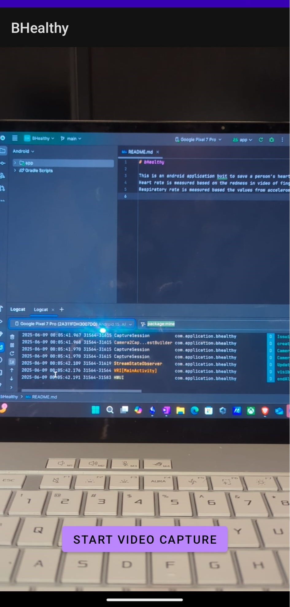
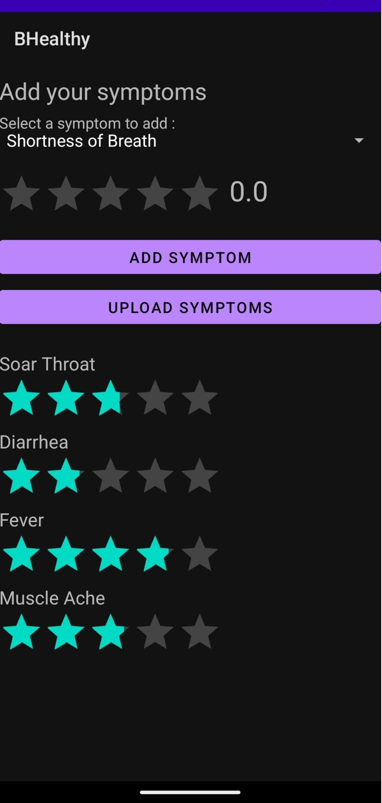
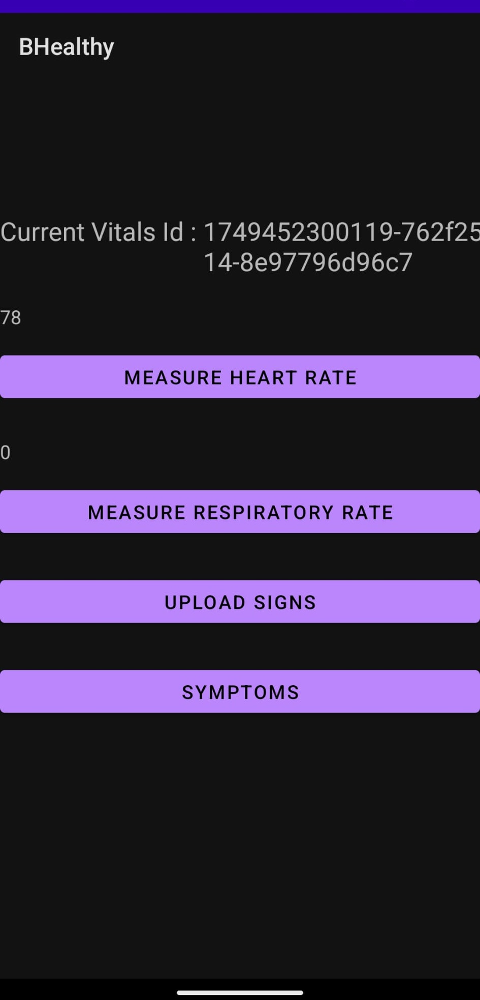

# bHealthy

[//]: # (This is an android application buit to save a person's heart rate, respiratoy rate and various symptoms. )

[//]: # (Heart rate is measured based on the redness in video of finger captured using back camera.)

[//]: # (Respiratory rate is measured based the values from accelerometer's readings when placed on user's chest.)


bHealthy 🏃‍♂️📊 is an Android application built in Kotlin that helps users manage and track their personal health metrics over time.

It provides a user-friendly interface to record key health indicators, view historical trends, and promote healthier habits through data insights.
This project demonstrates advanced usage of:

- Modern Android app architecture (MVVM)
- Kotlin Coroutines & Flow
- Jetpack Components (Room, LiveData, ViewModel)
- Data persistence and local storage
- Lifecycle-aware components

Part of my exploration into building robust, user-centric mobile apps.

## 🛠 Build & Run Instructions

Prerequisites:
- Android Studio Giraffe/ Hedgehog or later
- Android SDK 33+
- Gradle 8.x
- Kotlin 1.8+

## Steps

1. Clone this repo:
    ```
    git clone https://github.com/raviteja-reddy-guntaka/bHealthy.git
    ```
2. Open the project in Android Studio. 
3. Let Gradle sync and download dependencies. 
4. Run the app on an emulator or connected device:

Target SDK: Android 13+

Minimum SDK: Android 6.0 (API 23)

## Screenshots

|  |  |  |
|:------------------------------------------------------------:|:------------------------------------------------------------------:|:--------------------------------------------------------------------:|
|                      **Camera Screen**                       |                        **Symptoms Screen**                         |                           **Home Screen**                            |
